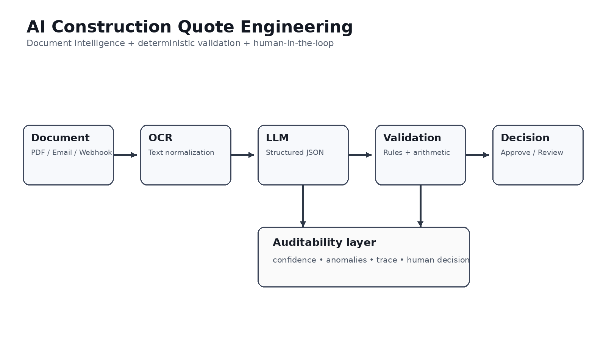

# AI Construction Quote Engineering — Intelligent Document Automation

**Walid Fadi · AI Engineering · Automation · Document Intelligence · n8n · Python · FastAPI**

> A production-oriented portfolio project for turning unstructured construction quotes into validated, auditable and actionable business decisions.



---

## 1. Executive summary

Construction and property workflows generate a large amount of semi-structured information: PDF quotes, scanned documents, supplier emails, line items, VAT, totals, deadlines and commercial conditions.

The problem is not simply **"ask an LLM to read a PDF"**. A reliable automation must combine:

- document ingestion;
- OCR when the PDF is scanned;
- semantic extraction with an LLM;
- strict structured outputs;
- deterministic arithmetic validation;
- confidence-aware decision making;
- anomaly detection;
- human-in-the-loop escalation;
- workflow orchestration;
- observability and auditability;
- API integration.

This repository implements that architecture as an **AI Engineering system**, rather than as a chatbot demo.

The central principle is:

> **The model extracts and interprets. Deterministic software verifies. Humans handle uncertainty.**

---

## 2. What the system does

```text
PDF / Email / Webhook
        │
        ▼
Document normalization
        │
        ├── native text → extraction
        │
        └── scanned PDF → OCR
                         │
                         ▼
                 LLM structured extraction
                         │
                         ▼
                 Schema validation
                         │
                         ▼
              Business / arithmetic checks
                         │
                  ┌──────┴──────┐
                  ▼             ▼
             trustworthy     uncertain
                  │             │
                  ▼             ▼
            Auto approval   Human review
                  │             │
                  └──────┬──────┘
                         ▼
                Audit + notification
```

The current implementation contains a working Python validation core and FastAPI endpoint, plus an n8n orchestration blueprint showing where OCR, LLM and business-system integrations plug in.

---

## 3. Why this is an AI Engineering project

A basic AI application often looks like:

```text
input → LLM → answer
```

This project deliberately goes further:

```text
input
  ↓
multimodal / document ingestion
  ↓
OCR / text normalization
  ↓
LLM structured prediction
  ↓
schema constraints
  ↓
deterministic verification
  ↓
confidence calibration
  ↓
policy / decision engine
  ↓
human escalation when necessary
  ↓
audit + downstream automation
```

This separation addresses several real engineering problems:

### Reliability
LLM output is probabilistic. Financial calculations should not be.

### Explainability
The system can expose which validation check failed instead of returning an opaque model answer.

### Safety
A low-confidence extraction should not silently trigger an important business action.

### Vendor independence
OCR and LLM providers are represented as adapters. The business logic does not depend on a single provider.

### Testability
Validation rules can be unit-tested without calling an external model.

### Automation
n8n acts as the orchestration layer around the AI/data components.

---

## 4. Target business use case

The prototype is designed for workflows involving construction, renovation and property operations.

A supplier can send a quote containing:

- company name;
- quote number;
- date;
- project / chantier;
- work lots;
- quantities;
- units;
- unit prices;
- line totals;
- total HT;
- VAT rate;
- total TTC;
- commercial conditions.

The objective is to transform that document into structured data and determine whether it can safely continue through an automated process.

Example:

```json
{
  "quote_number": "DEV-2026-041",
  "company": "BatiPro SARL",
  "project": "Rénovation Clermont - Lot isolation",
  "total_ht": 5050,
  "vat_rate": 20,
  "total_ttc": 6060,
  "confidence": 0.96
}
```

The system then verifies whether the numbers are internally consistent.

---

## 5. AI pipeline in detail

### Stage 1 — Ingestion

Potential entry points:

- Gmail attachment;
- Google Drive file;
- HTTP webhook;
- internal document-management system;
- manual upload.

The n8n layer is responsible for receiving and routing the document.

### Stage 2 — Document understanding

If the PDF contains machine-readable text, it can be parsed directly.

If it is a scan, an OCR provider can convert the image into text.

The architecture intentionally isolates this provider behind an adapter because OCR quality, latency and pricing can evolve independently from the rest of the system.

### Stage 3 — Structured LLM extraction

The LLM receives normalized document content and is instructed to produce a strict schema instead of free-form prose.

Conceptually:

```text
unstructured document
        ↓
semantic model inference
        ↓
structured JSON
        ↓
Pydantic validation
```

Typical extracted entities include:

| Field | Purpose |
|---|---|
| `quote_number` | traceability |
| `company` | supplier identification |
| `project` | chantier association |
| `items[]` | line-level structure |
| `quantity` | quantity verification |
| `unit_price_ht` | pricing analysis |
| `total_ht` | financial validation |
| `vat_rate` | tax verification |
| `total_ttc` | final amount verification |
| `confidence` | uncertainty management |

### Stage 4 — Deterministic validation

This is one of the most important design decisions.

For every line:

\[
T_i = Q_i \times P_i
\]

where:

- \(Q_i\) = quantity;
- \(P_i\) = unit price HT;
- \(T_i\) = expected line total.

Then:

\[
HT_{expected}=\sum_i T_i
\]

and:

\[
TTC_{expected}=HT\times(1+VAT/100)
\]

The implementation compares the expected values with the extracted values using small monetary tolerances to account for rounding.

This prevents the LLM from becoming the authority for arithmetic.

### Stage 5 — Decision engine

A simplified policy is:

```text
IF
  no critical anomaly
  AND confidence >= threshold
THEN
  AUTO_APPROVED
ELSE
  HUMAN_REVIEW
```

This can later evolve into a richer policy engine incorporating:

- supplier risk;
- amount thresholds;
- duplicate detection;
- missing mandatory fields;
- project budget;
- historical prices;
- abnormal unit prices;
- VAT inconsistencies;
- deadline conflicts.

### Stage 6 — Human-in-the-loop

Uncertainty is not treated as a failure.

Instead, the system creates a review task containing:

- extracted fields;
- source document;
- confidence score;
- failed checks;
- suggested correction;
- decision history.

The human becomes the final authority for ambiguous cases.

---

## 6. Architecture


The architecture separates **orchestration**, **AI inference**, **business logic** and **integration**.

```text
                  DATA / DOCUMENT LAYER
       Gmail ─── Drive ─── PDF ─── Webhook
                         │
                         ▼
                ORCHESTRATION LAYER
                       n8n
                         │
              ┌──────────┴──────────┐
              ▼                     ▼
         OCR Adapter          Text Parser
              │                     │
              └──────────┬──────────┘
                         ▼
                  AI INFERENCE
                  LLM Extraction
                         │
                         ▼
                 STRUCTURED DATA
                  Pydantic Schema
                         │
                         ▼
                VALIDATION ENGINE
            Rules + arithmetic + policy
                         │
                  ┌──────┴──────┐
                  ▼             ▼
              Approved       Review
                  │             │
                  └──────┬──────┘
                         ▼
                Audit / Database
                         │
                         ▼
             Business notifications
```

More details are available in [`docs/architecture.md`](docs/architecture.md).

---

## 7. Repository structure

```text
.
├── README.md
├── requirements.txt
├── .env.example
├── docker-compose.yml
│
├── src/
│   ├── api/
│   │   └── main.py
│   │
│   └── quote_engine/
│       ├── schemas.py
│       ├── validators.py
│       └── pipeline.py
│
├── tests/
│   └── test_validation.py
│
├── n8n/
│   └── workflow.json
│
├── data/
│   └── sample_quote.json
│
├── docker/
│   └── Dockerfile
│
└── docs/
    ├── architecture.md
    ├── portfolio_note.md
    └── screenshots/
```

---

## 8. Python engineering

The core engine is deliberately small and testable.

### `schemas.py`

Defines the domain model using Pydantic:

```python
class QuoteItem(BaseModel):
    description: str
    quantity: float
    unit: str
    unit_price_ht: float
    total_ht: float
```

This creates a contract between probabilistic extraction and deterministic software.

### `validators.py`

Contains the business-critical checks:

- line arithmetic;
- total HT consistency;
- VAT/TTC consistency;
- anomaly generation;
- decision status.

### `pipeline.py`

Coordinates schema validation and business validation.

The goal is to keep the pipeline provider-independent.

---

## 9. FastAPI service

The project exposes:

```http
GET /health
POST /v1/quotes/validate
```

Example:

```bash
curl -X POST http://localhost:8000/v1/quotes/validate \
  -H "Content-Type: application/json" \
  --data @data/sample_quote.json
```

The response contains the normalized quote and the decision engine result.

---

## 10. n8n orchestration

The n8n blueprint represents the automation layer:

```text
Webhook
   ↓
Normalize input
   ↓
OCR adapter
   ↓
LLM structured extraction
   ↓
Business validation API
   ↓
Decision
   ├── approved → notification
   └── uncertain → human review
```

This division is intentional:

- **n8n** handles workflow orchestration and integrations;
- **Python/FastAPI** handles reusable application logic;
- **LLM/OCR providers** handle specialized inference;
- **database/audit layer** persists operational state.

That makes the system easier to evolve than putting every rule inside a visual workflow.

---

## 11. Reliability strategy

An AI automation that handles business documents should not rely on one confidence number.

A production version should combine several signals:

\[
S = w_1C_{model}+w_2C_{schema}+w_3C_{arithmetic}+w_4C_{business}
\]

where each component represents a different evidence source.

For example:

- model confidence / extraction certainty;
- schema completeness;
- arithmetic consistency;
- business-rule consistency.

A future implementation could calibrate this score on a labelled validation dataset instead of choosing weights manually.

---

## 12. Advanced AI Engineering extensions

The architecture is intentionally extensible.

### A. Retrieval-augmented supplier intelligence

A historical quote database could be used to retrieve comparable prices:

```text
current quote
     ↓
semantic retrieval
     ↓
comparable historical quotes
     ↓
price anomaly detection
```

### B. Graph-based project knowledge

The extracted entities can form a graph:

```text
Project ──has_quote──> Quote
   │                     │
   │                     ├──issued_by──> Supplier
   │                     ├──contains───> WorkItem
   │                     └──concerns───> Lot
```

This creates a bridge toward Knowledge Graph / GraphRAG systems.

### C. Anomaly detection

Instead of only checking arithmetic, a statistical model could detect:

- unusually high unit prices;
- unusual quantities;
- supplier-specific deviations;
- duplicate quotes;
- suspicious temporal patterns.

### D. Human feedback loop

Human corrections can become labelled examples:

```text
AI extraction
      ↓
Human correction
      ↓
validated dataset
      ↓
evaluation / prompt improvement / model adaptation
```

This creates a continuous improvement loop without blindly retraining on every document.

### E. Evaluation framework

A production evaluation suite should measure:

- field-level precision / recall;
- exact-match rate;
- numeric error rate;
- false auto-approval rate;
- human-review rate;
- latency;
- cost per document.

For critical automation, **false auto-approval** is often more important than raw extraction accuracy.

---

## 13. Security and production considerations

Secrets are not committed to Git.

Use environment variables or a secrets manager for:

- LLM API keys;
- OCR credentials;
- database credentials;
- Gmail OAuth credentials;
- webhook secrets.

A production deployment should additionally implement:

- authentication and authorization;
- encrypted document storage;
- retention policies;
- PII minimization;
- structured logs;
- trace IDs;
- retry policies;
- idempotency keys;
- rate limiting;
- access control;
- monitoring and alerting.

---

## 14. Local installation

### Clone

```bash
git clone <your-repository-url>
cd ai-construction-quote-engineering-walid-fadi
```

### Create environment

```bash
python -m venv .venv
```

Linux/macOS:

```bash
source .venv/bin/activate
```

Windows:

```powershell
.venv\Scripts\activate
```

### Install dependencies

```bash
pip install -r requirements.txt
```

### Run tests

```bash
pytest -q
```

### Start API

```bash
PYTHONPATH=src uvicorn api.main:app --reload
```

Windows PowerShell:

```powershell
$env:PYTHONPATH="src"
uvicorn api.main:app --reload
```

---

## 15. Docker

```bash
docker compose up --build
```

The API is exposed on port `8000`.

Health check:

```text
http://localhost:8000/health
```

---

## 16. Example decision

### Consistent quote

```text
HT = 5 050 €
VAT = 20 %
Expected TTC = 6 060 €
Extracted TTC = 6 060 €
Confidence = 0.96

→ AUTO_APPROVED
```

### Inconsistent quote

```text
HT = 5 050 €
VAT = 20 %
Expected TTC = 6 060 €
Extracted TTC = 6 300 €

→ HUMAN_REVIEW
Reason: TTC does not match HT + VAT
```

The second case is exactly where a naive `LLM → action` architecture becomes dangerous.

---

## 17. What this demonstrates to a recruiter

This repository demonstrates experience with:

### AI
- LLM structured extraction;
- confidence-aware inference;
- document intelligence;
- anomaly detection concepts;
- human-in-the-loop AI;
- evaluation methodology.

### Software engineering
- Python;
- FastAPI;
- Pydantic;
- typed domain models;
- unit tests;
- Docker;
- API design;
- environment-based configuration.

### Automation
- n8n;
- webhooks;
- API orchestration;
- notifications;
- workflow branching;
- retry / escalation architecture.

### Data / systems
- structured JSON;
- relational persistence architecture;
- auditability;
- provider abstraction;
- deterministic validation.

The important point is that the project connects **AI inference to reliable software systems**.

---

## 18. Relationship to an AI Builder / Automation role

The architecture maps naturally to an AI Builder environment where the objective is not only to build models but to make AI useful inside existing business processes.

For a company handling construction / property operations, the same architecture can be adapted to:

- quote processing;
- supplier onboarding;
- document classification;
- invoice workflows;
- CRM enrichment;
- email triage;
- anomaly detection;
- automated reporting;
- internal copilots;
- approval workflows.

The project therefore focuses on a transferable engineering pattern rather than one isolated prompt.

---

## 19. Roadmap

### V1 — implemented

- structured quote schema;
- deterministic validation;
- anomaly reporting;
- confidence-aware decision;
- FastAPI endpoint;
- unit tests;
- Docker packaging;
- n8n orchestration blueprint.

### V2 — next production step

- real PDF ingestion;
- real OCR provider;
- real LLM structured-output adapter;
- PostgreSQL persistence;
- Gmail/Drive integration;
- Telegram/Slack notification;
- review UI.

### V3 — advanced AI

- historical quote retrieval;
- supplier price baselines;
- anomaly detection model;
- Knowledge Graph;
- GraphRAG;
- evaluation dashboard;
- active-learning feedback loop.

---

## 20. Project philosophy

The project follows a simple engineering principle:

> **Do not use an LLM where deterministic software is better. Do not use deterministic rules where semantic understanding is required. Use humans when uncertainty matters.**

That principle is what turns an LLM demo into an AI-enabled production workflow.

---

## 21. Portfolio / attribution note

This repository is an **original portfolio implementation by Walid Fadi**. It is inspired by established AI document-processing patterns and public examples, but it is not presented as a fork or rebranding of another author's repository.

Provider-specific integrations are intentionally abstracted in this portfolio version. Credentials are never included in the repository.

See [`docs/portfolio_note.md`](docs/portfolio_note.md).

---

## Author

**Walid Fadi**  
AI Engineering · Data Engineering · Automation · Machine Learning

GitHub: `walidfadi112`
